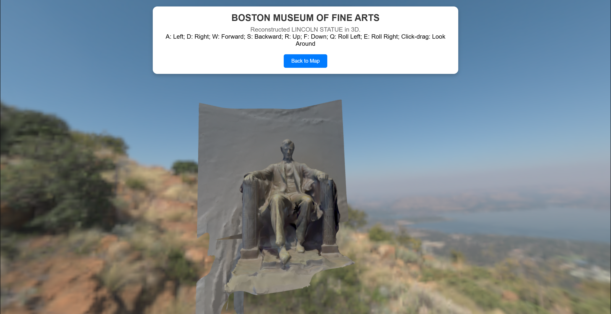
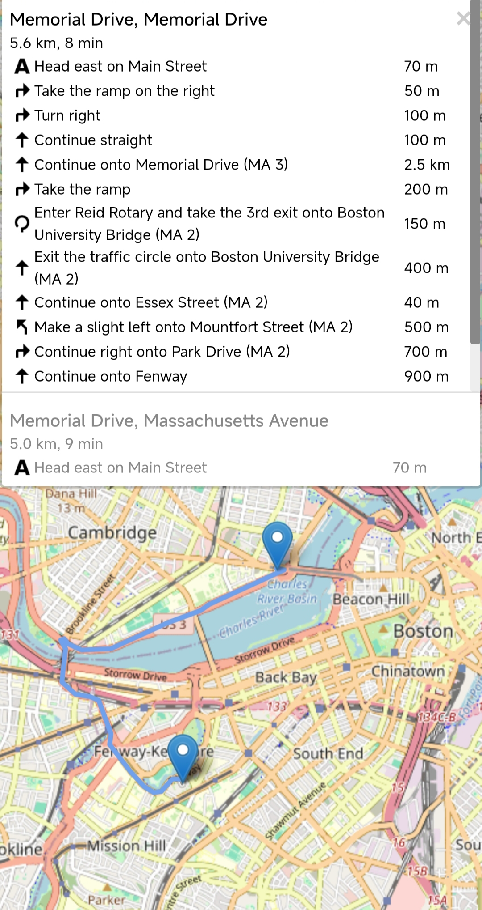

<!--# Boston in 3D: A Citywide Object Archive Using Nerfstudio-->

<div align="center">
  <h1>Boston in 3D</h1>
  <h3>A Citywide Object Archive Using Nerf Studio</h3>
  <p>Reconstructing objects across the city of Boston using Nerf Studio.</p>

[](https://opensource.org/licenses/MIT)
[](https://nvidia-mit.vercel.app/)
[](https://github.com/Charley-xiao/NVIDIA_MIT)

</div>

## Motivation

Boston is a city rich in history and culture. We wanted to create an immersive experience that allows users to explore the city in 3D and learn more about the objects around them. By using Nerf Studio, we were able to generate 3D models of objects across the city and display them on a map.

## Features

- [x] 3D models of objects across Boston
- [x] Interactive map with routing
- [x] User-friendly interface

## Technical Details

### Obtaining Models

We scan various objects all over Boston using PolyCam, a mobile app that captures 3D models of objects. The models are then uploaded to the Nerf Studio platform, where a model is trained to generate a 3D model of the object. We then export the model and textures to be used in the Boston Immersive Map.


### Visualizing Models

The 3D models are loaded into the scene and displayed on the map using the Three.js library. To make the scene more realistic, we download relevant HDRIs from [Poly Haven](https://polyhaven.com/) and apply them to the scene.



### Map Integration

The map is built using [Open Street Map](https://www.openstreetmap.org/) and [Leaflet](https://leafletjs.com/). 

### Routing

To let users navigate the map, we use the [Leaflet Routing Machine](https://www.liedman.net/leaflet-routing-machine/) plugin. This allows users to input a starting and ending location and get directions on the map.



### User Interface

The user interface is built using React.js.


### Deployment

The project is deployed on Vercel and can be accessed [here](https://nvidia-mit.vercel.app/).

## Installation

1. Clone the repository:

```bash
git clone https://github.com/JohnYechanJo/NVIDIA_MIT
# or
git clone https://github.com/Charley-xiao/NVIDIA_MIT
```

depending on the version you want to clone. Carefully check the branch you are cloning.

2. Install the dependencies:

```bash
cd boston-immersive-map
npm install
```

3. Start the development server:

```bash
npm start
```

4. Open the browser and go to `http://localhost:3000/`.

## Future Work

- [ ] Add more objects, especially historical landmarks and large buildings, to the map
- [ ] Improve the user interface and add more interactive features
- [ ] Allow users to upload their own 3D models and display them on the map
- [ ] Direct integration with Nerf Studio for real-time model generation


## Contributors

<table>
  <tr>
    <td align="center"><a href="https://github.com/Charley-xiao"><br /><sub><b>Qiwen Xiao</b></sub></a><br /></td>
    <td align="center"><a href="https://avatars.githubusercontent.com/u/131790222?v=4"><br /><sub><b>John Yechan Jo</b></sub></a><br /></td>
    <td align="center"><a href="https://avatars.githubusercontent.com/u/136285291?v=4"><br /><sub><b>Wenbo An</b></sub></a><br /></td>
    </tr>
</table>

## Acknowledgements

This project was part of MIT xPro 2025 AI+X Bootcamp, January to February, 2025, under the guidance of [Yifei Li](https://people.csail.mit.edu/liyifei/).

## License

This project is licensed under the MIT License - see the [LICENSE](./MIT_License) file for details.


## Contributing

Pull requests are welcome. For major changes, please open an issue first to discuss what you would like to change.

### Before Push

Tar the models and textures.

```bash
cd boston-immersive-map/public
tar -czvf models.tar.gz models textures
```

### When Push

Name the commit message as "{Name} + {Content}".

Example: John + Nerf Code Push

### After Push

Keep an eye on the workflow to see if the tar file is in the correct format.