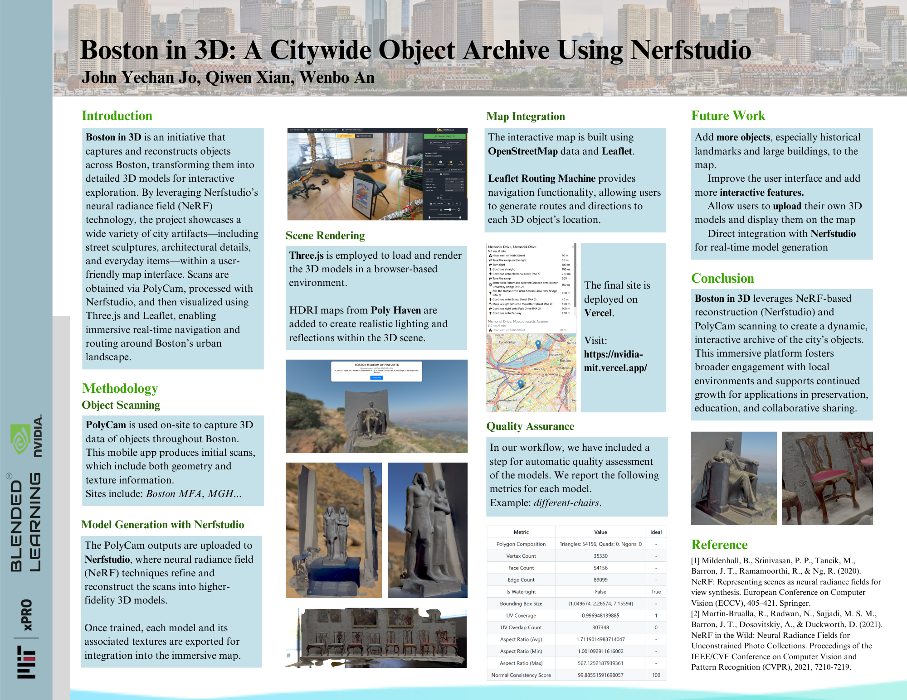

<div align="center">

<br>

  <h3>A Citywide Object Archive Using Nerfstudio</h3>
  <p>Reconstructing objects across the city of Boston using Nerfstudio.</p>

[](https://nvidia-mit.vercel.app/)

[](https://opensource.org/licenses/MIT)
[](https://github.com/Charley-xiao/NVIDIA_MIT/commits/main)
[](https://github.com/JohnYechanJo/NVIDIA_MIT/issues)


## Contributors

[](https://github.com/JohnYechanJo/NVIDIA_MIT/graphs/contributors)

<table>
  <tr>
    <td align="center"><a href="https://github.com/Charley-xiao"><br /><sub><b>Qiwen Xiao</b></sub></a><br /></td>
    <td align="center"><a href="https://github.com/JohnYechanJo"><br /><sub><b>John Yechan Jo</b></sub></a><br /></td>
    <td align="center"><a href="https://github.com/Athjon"><br /><sub><b>Wenbo An</b></sub></a><br /></td>
    </tr>
</table>


</div>

## Motivation

Boston is a city rich in history and culture. We want to create an immersive experience that allows users to explore the city in 3D and learn more about the objects around them. By using Nerfstudio, we are able to generate 3D models of objects across the city and display them on a map.

## Features

- [x] 3D models of objects across Boston
- [x] Interactive map with routing
- [x] User-friendly interface

## Technical Details

### Obtaining Models

We scan various objects all over Boston using PolyCam, a mobile app that captures 3D models of objects. The models are then uploaded to the Nerfstudio platform, where a model is trained to generate a 3D model of the object. We then export the model and textures to be used in the Boston Immersive Map.


### Visualizing Models

The 3D models are loaded into the scene and displayed on the map using the Three.js library. To make the scene more realistic, we download relevant HDRIs from [Poly Haven](https://polyhaven.com/) and apply them to the scene.


### Map Integration

The map is built using [Open Street Map](https://www.openstreetmap.org/) and [Leaflet](https://leafletjs.com/). 

### Routing

To let users navigate the map, we use the [Leaflet Routing Machine](https://www.liedman.net/leaflet-routing-machine/) plugin. This allows users to input a starting and ending location and get directions on the map.

<div align=center>

</div>

### User Interface

The user interface is built using React.js.


### Deployment

The project is deployed on Vercel and can be accessed [here](https://nvidia-mit.vercel.app/).

## Quality Assurance

While we have made every effort to ensure the accuracy of the models, there may be some discrepancies due to the limitations of the scanning and training process. In our workflow, we have included a step for automatic quality assessment of the models. We report the following metrics for each model:

- **Polygon Composition** describes the number of triangles, quads, and ngons in the model.
- **Vertex Count** is the number of vertices in the model.
- **Face Count** is the number of faces in the model.
- **Edge Count** is the number of edges in the model.
- **Is Watertight** indicates whether the model is watertight, i.e., there are no holes in the mesh.
- **Bounding Box Size** gives the size of the bounding box of the model.
- **UV Coverage** is the percentage of the UV space covered by the model, recommended to be close to 1.
- **UV Overlap Count** is the number of overlapping UVs in the model, which should be minimized.
- **Aspect Ratio** describes the aspect ratio of the faces in the model, with the average, minimum, and maximum values reported. A high aspect ratio indicates stretched faces.
- **Normal Consistency Score** is the percentage of faces in the model that have consistent normals, recommended to be close to 100.

Example (`different-chairs`):

| Metric                   | Value      | Ideal |
|:--------------------------:|:------------:|:-----------:|
| Polygon Composition       | Triangles: 54156, Quads: 0, Ngons: 0 | -          |
| Vertex Count              | 35330      | -          |
| Face Count                | 54156      | -          |
| Edge Count                | 89099      | -          |
| Is Watertight             | False      | True       |
| Bounding Box Size         | [1.049674, 2.28574, 7.15594] | -          |
| UV Coverage               | 0.996948139885 | 1          |
| UV Overlap Count          | 307348     | 0          |
| Aspect Ratio (Avg)        | 1.7119014983714047 | -          |
| Aspect Ratio (Min)        | 1.001092911616002 | -          |
| Aspect Ratio (Max)        | 567.1252187939361 | -          |
| Normal Consistency Score  | 99.88551591698057 | 100        |

See [workflows](https://github.com/Charley-xiao/NVIDIA_MIT/actions) for more details.

## Installation

1. Clone the repository:

```bash
git clone https://github.com/JohnYechanJo/NVIDIA_MIT
# or
git clone https://github.com/Charley-xiao/NVIDIA_MIT
```

depending on the version you want to clone. Carefully check the branch you are cloning.

2. Install the dependencies:

```bash
cd boston-immersive-map
npm install
```

3. Start the development server:

```bash
npm start
```

4. Open the browser and go to `http://localhost:3000/`.

## Future Work

- [ ] Add more objects, especially historical landmarks and large buildings, to the map
- [ ] Improve the user interface and add more interactive features
- [ ] Allow users to upload their own 3D models and display them on the map
- [ ] Direct integration with Nerfstudio for real-time model generation

## Acknowledgements

This project was part of Winter 2025 MIT AI+X On-Campus Experience, January to February, 2025, under the guidance of [Yifei Li](https://people.csail.mit.edu/liyifei/).

## License

This project is licensed under the MIT License - see the [LICENSE](./MIT_License) file for details.


## Contributing

Pull requests are welcome. For major changes, please open an issue first to discuss what you would like to change.

### Before Push

Tar and compress the models and textures.

```bash
cd boston-immersive-map/public
tar -czvf models.tar.gz models textures
```

### When Push

Name the commit message as "{Name} + {Content}".

Example: John + Nerf Code Push

### After Push

Keep an eye on the workflow to see if the compressed file is in the correct format.
